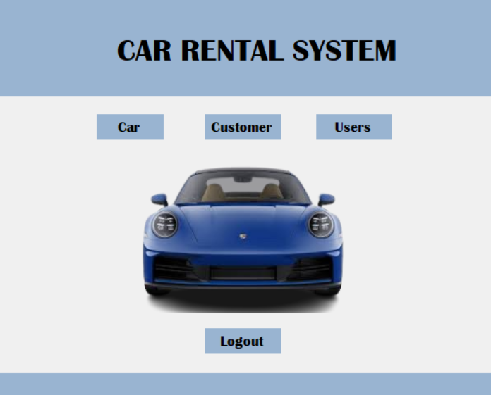
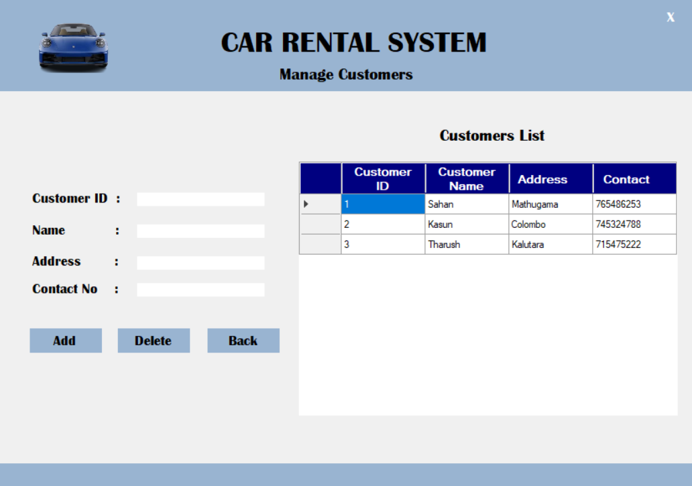
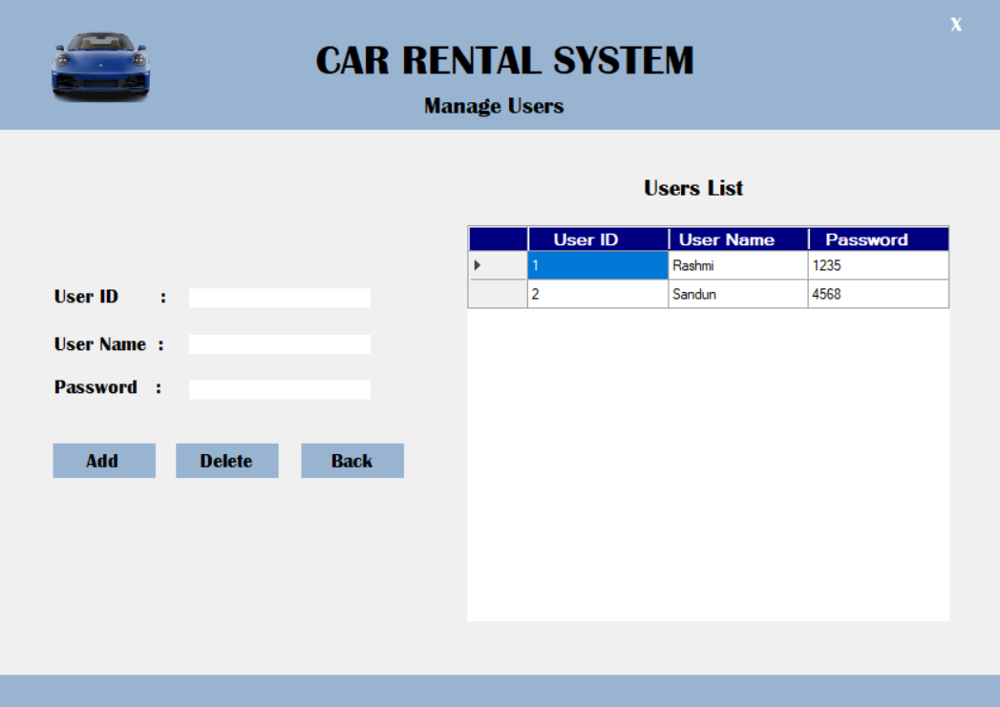

# 🚗 Car Rental System - C# Windows Forms (OOP Project)

A simple Car Rental System built using <b>C#</b> and <b>Windows Forms</b>, showcasing core <b>Object-Oriented Programming</b> concepts like <b>Encapsulation</b> and <b>Polymorphism</b>. This system runs <b>without a database</b>, using <b>in-memory Lists</b> to manage data such as cars, customers, rentals, and users.

## ⚙️ Technologies Used

- C#
- Windows Forms (.NET Framework)
- Visual Studio
- No database – uses Lists for data handling

## ✨ Features

- 🚘 Manage Car Records
- 👤 Manage Customer Records
- 📄 Handle Rentals & Returns
- 🔐 Simple Login System
- 📊 Clean, responsive GUI with a loading screen
- 🧠 OOP-based logic (no database required)

## 🖥️ UI Snapshot 

 
 
 

>

 
 
 

## 📖 Usage Instructions
  
- Start the system and wait for the loading screen to complete.
- Log in using a predefined user..
> Navigate through:
- Cars – Add/edit/delete car records
- Customers – Manage customer profiles
- Rentals – Rent or return a car
- View results in DataGridViews dynamically updated from Lists.

## 📌 Notes
- This project is ideal for beginners learning Windows Forms with C#.
- You can upgrade it by adding database support later.

